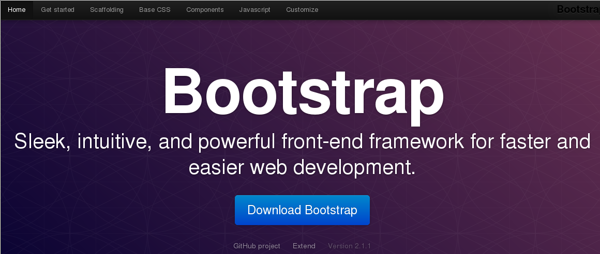
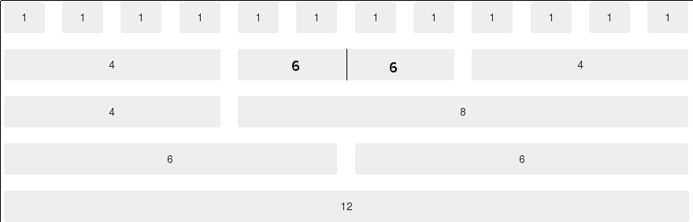
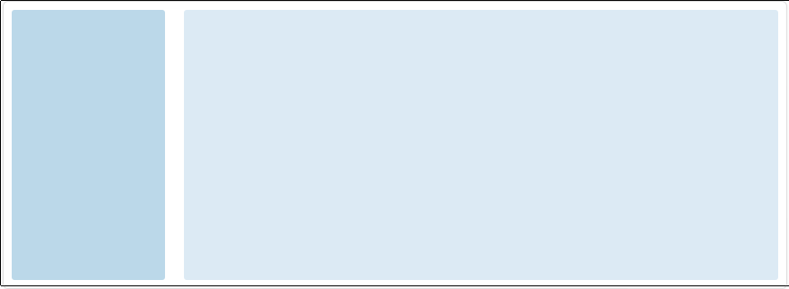
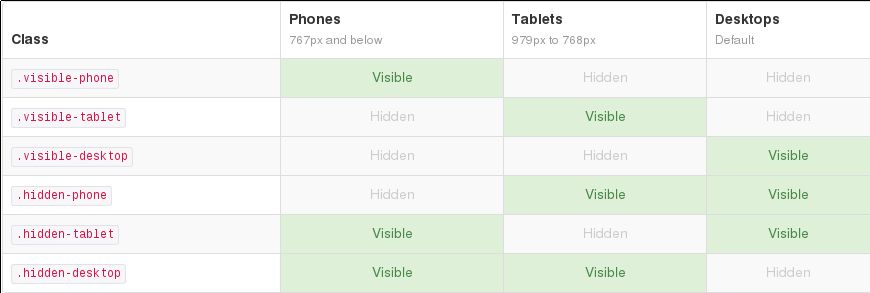

Création d'une charte graphique avec Bootstrap
==============================================

---

Boot quoi ?
===========

Des classes CSS pour faire une charte graphique pro

* Facilement
* Rapidement

---

Fonctionnalités
===============

<!--
<head>
<link type="text/css" rel="stylesheet" href="twitter-bootstrap-c52368d/bootstrap/css/bootstrap.min.css" />
<link type="text/css" rel="stylesheet" href="twitter-bootstrap-c52368d/bootstrap/css/bootstrap-responsive.min.css" />
</head>
-->

* Scaffolding : Outils pour réaliser un prototype de design
    * Grille : Découpage en colonnes tel un tableau <strike>Excel</strike> Libreoffice Calc
    * Responsive design : Interface adaptée à une TV, un PC, un smartphone, une tablette, ... Démo !
* CSS de base : Formulaires, tableaux, ...
* Composants : Boutons, onglets, listes, barres de navigation, ...
* Plugins javascript

---

Principes de base
=================

Installation
------------

* Télécharger bootstrap
* Dans le bloc délimité par la balise head, ajouter

        !html
        <link href="css/bootstrap.min.css" rel="stylesheet">

Utilisation
-----------

Associer les éléments HTML à des classes CSS prédéfinies dans bootstrap

Exemple :

    !html
    Success

---

Grille
======

* Grille de 12 colonnes
* Chaque zone est encore divisible en 12 colonnes

---

Grille - Exemple d'utilisation
==============================

    !html
    

        

            

                <!-- Barre latérale -->
            

            

                <!-- Corps -->
            

        

    

---

Responsive Design
=================

Installation
------------

* Dans le bloc délimité par la balise head, ajouter

        !html
        <meta name="viewport" content="width=device-width, initial-scale=1.0">
        <link href="css/bootstrap-responsive.min.css" rel="stylesheet">

Utilisation
-----------

---

Au boulot !
===========
